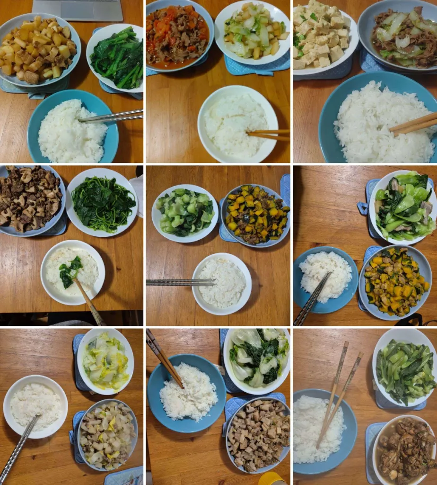
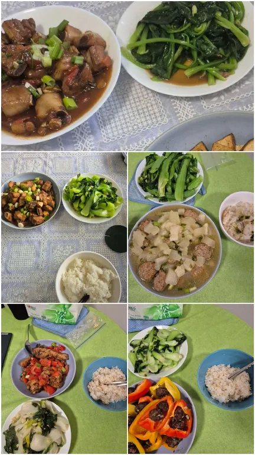
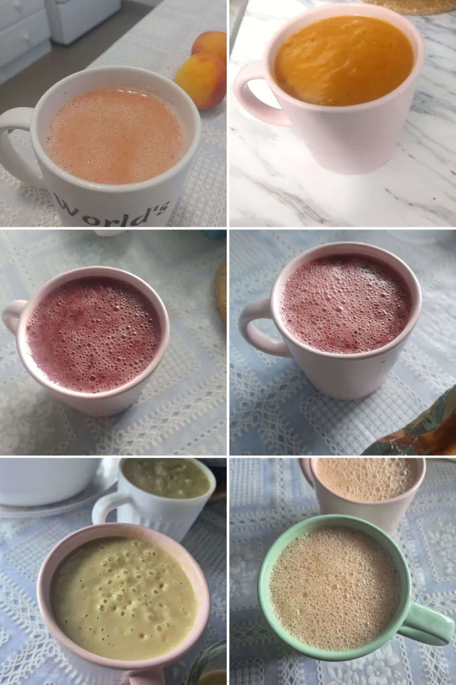
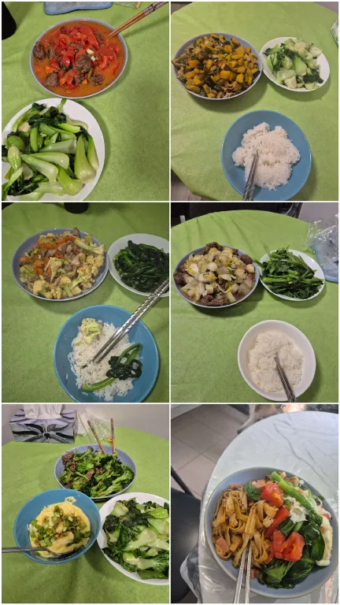
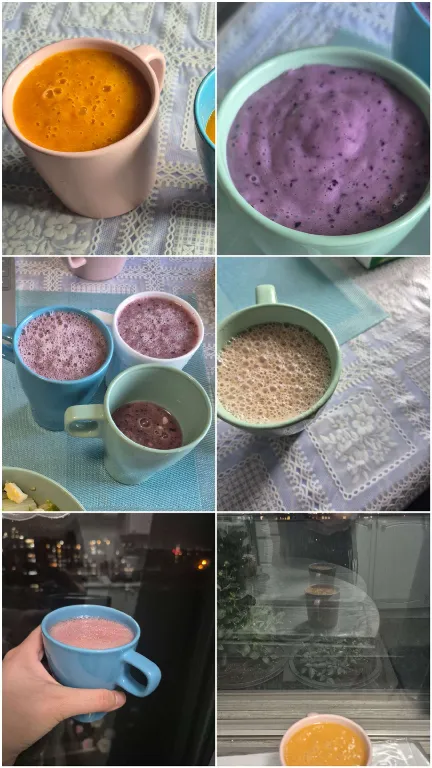

When I'm not working, I like to cook, work out, and take my dog on walks. Please enjoy photo compilations of past meals and outdoor hikes below :)

  <!-- Slide 1 -->
  

    <h2>A Little Life</h2>

    

      
      
      
      
      
    

  

  <!-- Slide 2 -->
  

    <h2>Places</h2>

    

      
      
      
    

  

  <!-- Navigation -->
  <button class="carousel-button prev" onclick="changeSlide(-1)">&#8592;</button>

  
    1 / 2
  

  <button class="carousel-button next" onclick="changeSlide(1)">&#8594;</button>

