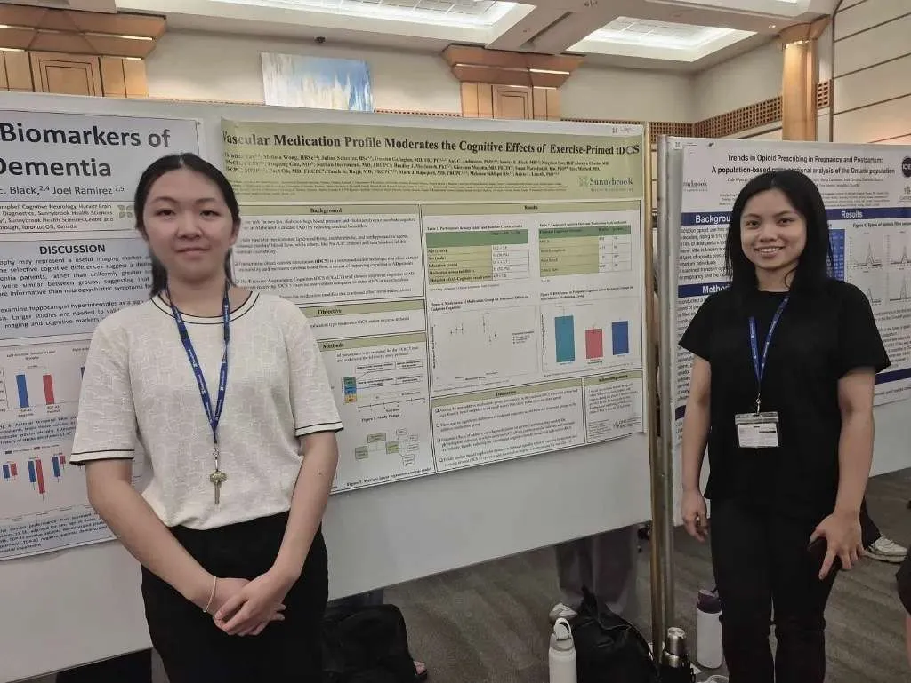
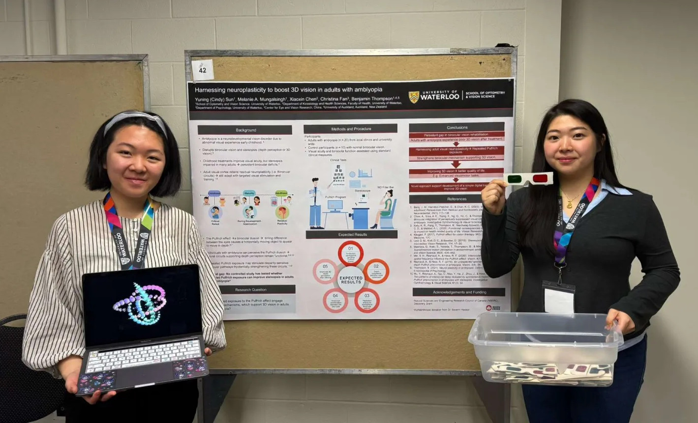
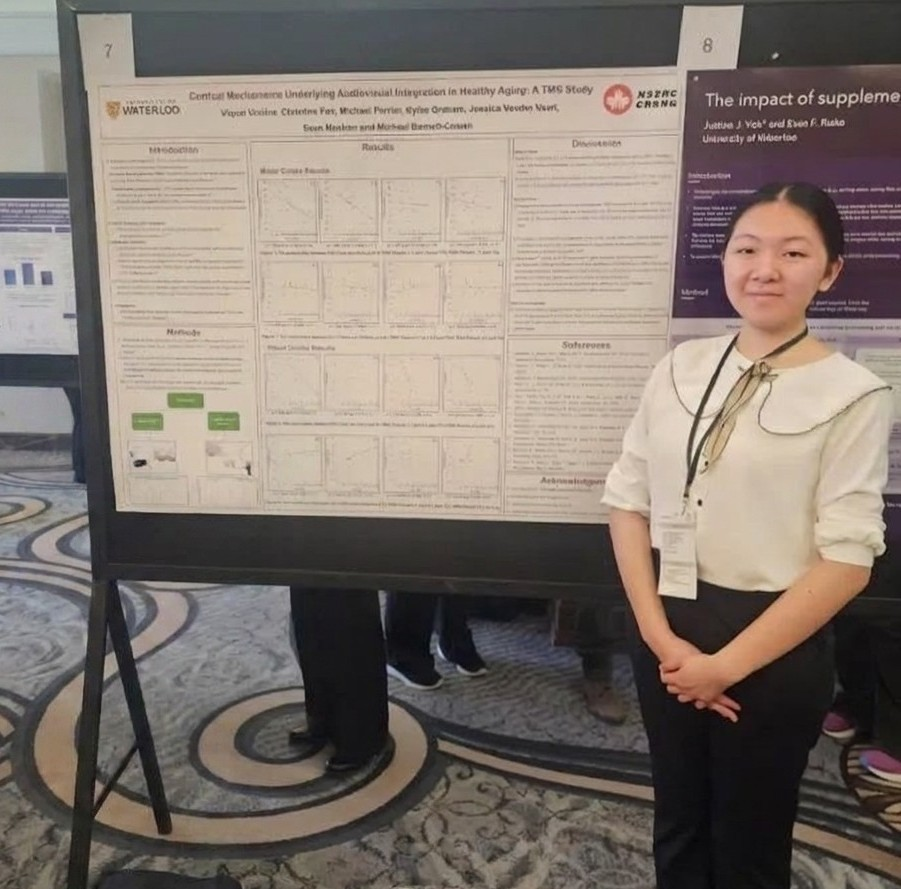

## Sunnybrook Summer Student Poster Competition 2026
{width=250px}
### Title: Vascular Medication Profile Moderates the Cognitive Effects of Exercise-Primed tDCS

August 12th, 2026; This project explored the moderation effect of older adults' vascular medication type on their response to different types of treatment in terms of their cognition.

## PATh Symposium 2026
{width=250px}
### Title: Harnessing Neuroplasticity to Boost 3D Vision in Adults with Amblyopia

April 7th, 2026; This presentation features the proposal of the use of an optical illusion called the Pulfrich Effect to improve stereopsis in adults with amblyopia.

## LOVE Conference 2026
{width=250px}
### Title: Cortical Mechanisms Underlying Audiovisual Integration in Healthy Aging: A TMS Study

February 6th; This study examines the use of TMS to modify cortical inhibition processes in the occipital cortex and its impacts on multisensory integration in older adults.
